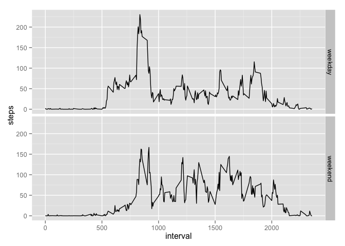

# Reproducible Research: Peer Assessment 1

#### Notes

- Uses `dplyr` and `ggplot2` packages

## Loading and preprocessing the data

1. Load the data


```r
setwd("/Volumes/RMS/Data Science/Coursera/Reproducible_Research/Assignment_1")
allData <- read.csv("activity.csv", header = T)
```

2. Process/transform the data (if necessary) into a format suitable for your analysis

- adds POSIX column

```r
allData$DateTime <- strptime(paste(allData$date, sprintf("%04d", allData$interval)), format = "%Y-%m-%d %H%M")
```


## What is mean total number of steps taken per day?


```r
require(dplyr); require(lubridate)
```


1. Calculate the total number of steps taken per day

```r
daily_steps <- group_by(allData[1:3], date) %>% select(date, steps) %>% summarize(steps = sum(steps, na.rm = T))
```

2. Make a histogram of the total number of steps taken each day

```r
hist(daily_steps$steps, breaks = 10, main = "Daily Steps", xlab = "Steps")
```

 

3. Calculate and report the mean and median of the total number of steps taken per day

```r
daily_mean <- mean(daily_steps$steps)
daily_median <- median(daily_steps$steps)
```

The mean number of steps taken per day was 9354.2295082

The median number of steps taken per day was 10395


## What is the average daily activity pattern?

1. Make a time series plot (i.e. `type = 'l'`) of the 5-minute interval (x-axis ) and the average number of steps taken, averaged across all days (y-axis)


```r
minute_avg <- group_by(allData[,1:3], interval) %>% select(interval, steps) %>% summarize(steps = mean(steps, na.rm = T))

plot(minute_avg, type = "l", main = "Steps by 5 minute interval")
```

 

2. Which 5-minute interval, on average across all the days in the dataset, contains the maximum number of steps?


```r
head(minute_avg[order(minute_avg$steps, decreasing = T),],1)
```

```
## Source: local data frame [1 x 2]
## 
##   interval    steps
## 1      835 206.1698
```

Interval 835 contains the maximum number of steps.

## Imputing missing values

1. Calculate and report the total number of missing values in the dataset (i.e. the total number of rows with NAs)

```r
sum(is.na(allData$steps))
```

```
## [1] 2304
```

2. Devise a strategy for filling in all of the missing values in the dataset. The strategy does not need to be sophisticated. For example, you could use the mean/median for that day, or the mean for that 5-minute interval, etc.

I'm going to just use the minute average to fill in missing

3. Create a new dataset that is equal to the original dataset but with the missing data filled in.

```r
# duplicate data
allData2 <- allData
# minute avg col (with replication)
allData2$minute_avg <- minute_avg$steps
# fill in NAs
allData2$steps[is.na(allData2$steps)] <- allData2$minute_avg[is.na(allData2$steps)]
# remove minute_avg col
allData2 <- allData2[,1:4]
```


4.  Make a histogram of the total number of steps taken each day and Calculate and report the mean and median total number of steps taken per day. Do these values differ from the estimates from the first part of the assignment? What is the impact of imputing missing data on the estimates of the total daily number of steps?

```r
new_daily_steps <- group_by(allData2[1:3], date) %>% select(date, steps) %>% summarize(steps = sum(steps, na.rm = T))

# histogram of the number of steps
hist(new_daily_steps$steps, breaks = 10, main = "Daily Steps", xlab = "Steps")
```

 

```r
# calculate and report the mean and median
new_daily_mean <- mean(new_daily_steps$steps)
new_daily_median <- median(new_daily_steps$steps)
```

Using the minute average to replace missing values, the new mean number of steps taken per day was 1.0766189\times 10^{4}

Using the minute average to replace missing values, the new median number of steps taken per day was 1.0766189\times 10^{4}


```r
# do these values differ from the previous estimates
new_daily_mean - daily_mean
```

```
## [1] 1411.959
```

```r
new_daily_median - daily_median
```

```
## [1] 371.1887
```
These differ from the estimates from the first part of the assignment.


```r
# What is the impact of imputing missing data on the estimates of the total daily number of steps?
all_daily_steps <- cbind(daily_steps, new_steps = new_daily_steps$steps)
mutate(all_daily_steps, impact = new_steps - steps)
```

```
##          date steps new_steps   impact
## 1  2012-10-01     0  10766.19 10766.19
## 2  2012-10-02   126    126.00     0.00
## 3  2012-10-03 11352  11352.00     0.00
## 4  2012-10-04 12116  12116.00     0.00
## 5  2012-10-05 13294  13294.00     0.00
## 6  2012-10-06 15420  15420.00     0.00
## 7  2012-10-07 11015  11015.00     0.00
## 8  2012-10-08     0  10766.19 10766.19
## 9  2012-10-09 12811  12811.00     0.00
## 10 2012-10-10  9900   9900.00     0.00
## 11 2012-10-11 10304  10304.00     0.00
## 12 2012-10-12 17382  17382.00     0.00
## 13 2012-10-13 12426  12426.00     0.00
## 14 2012-10-14 15098  15098.00     0.00
## 15 2012-10-15 10139  10139.00     0.00
## 16 2012-10-16 15084  15084.00     0.00
## 17 2012-10-17 13452  13452.00     0.00
## 18 2012-10-18 10056  10056.00     0.00
## 19 2012-10-19 11829  11829.00     0.00
## 20 2012-10-20 10395  10395.00     0.00
## 21 2012-10-21  8821   8821.00     0.00
## 22 2012-10-22 13460  13460.00     0.00
## 23 2012-10-23  8918   8918.00     0.00
## 24 2012-10-24  8355   8355.00     0.00
## 25 2012-10-25  2492   2492.00     0.00
## 26 2012-10-26  6778   6778.00     0.00
## 27 2012-10-27 10119  10119.00     0.00
## 28 2012-10-28 11458  11458.00     0.00
## 29 2012-10-29  5018   5018.00     0.00
## 30 2012-10-30  9819   9819.00     0.00
## 31 2012-10-31 15414  15414.00     0.00
## 32 2012-11-01     0  10766.19 10766.19
## 33 2012-11-02 10600  10600.00     0.00
## 34 2012-11-03 10571  10571.00     0.00
## 35 2012-11-04     0  10766.19 10766.19
## 36 2012-11-05 10439  10439.00     0.00
## 37 2012-11-06  8334   8334.00     0.00
## 38 2012-11-07 12883  12883.00     0.00
## 39 2012-11-08  3219   3219.00     0.00
## 40 2012-11-09     0  10766.19 10766.19
## 41 2012-11-10     0  10766.19 10766.19
## 42 2012-11-11 12608  12608.00     0.00
## 43 2012-11-12 10765  10765.00     0.00
## 44 2012-11-13  7336   7336.00     0.00
## 45 2012-11-14     0  10766.19 10766.19
## 46 2012-11-15    41     41.00     0.00
## 47 2012-11-16  5441   5441.00     0.00
## 48 2012-11-17 14339  14339.00     0.00
## 49 2012-11-18 15110  15110.00     0.00
## 50 2012-11-19  8841   8841.00     0.00
## 51 2012-11-20  4472   4472.00     0.00
## 52 2012-11-21 12787  12787.00     0.00
## 53 2012-11-22 20427  20427.00     0.00
## 54 2012-11-23 21194  21194.00     0.00
## 55 2012-11-24 14478  14478.00     0.00
## 56 2012-11-25 11834  11834.00     0.00
## 57 2012-11-26 11162  11162.00     0.00
## 58 2012-11-27 13646  13646.00     0.00
## 59 2012-11-28 10183  10183.00     0.00
## 60 2012-11-29  7047   7047.00     0.00
## 61 2012-11-30     0  10766.19 10766.19
```

## Are there differences in activity patterns between weekdays and weekends?

1.  Create a new factor variable in the dataset with two levels – “weekday” and “weekend” indicating whether a given date is a weekday or weekend day.


```r
# weekday function
wkd.f <- function(day) {
  if(day=="Saturday" | day == "Sunday") {
    return("weekend") 
    } else {
    return("weekday")      
    }
}
```


```r
# add weekend / weekday factor variable
allData2$weekday <- factor(sapply(weekdays(allData2$DateTime), wkd.f))
```

2.  Make a panel plot containing a time series plot (i.e. type = "l") of the 5-minute interval (x-axis) and the average number of steps taken, averaged across all weekday days or weekend days (y-axis). See the README file in the GitHub repository to see an example of what this plot should look like using simulated data.


```r
require(ggplot2)
```

```
## Loading required package: ggplot2
```

```r
# dataset averaged across minute by factor weekday
wkdy.f_minute_avg <- group_by(allData2[,c(1:3,5)], weekday, interval) %>% summarize(steps = mean(steps))

ggplot(wkdy.f_minute_avg, aes(x = interval, y = steps)) + geom_line() + facet_grid(weekday ~ .)
```

 

